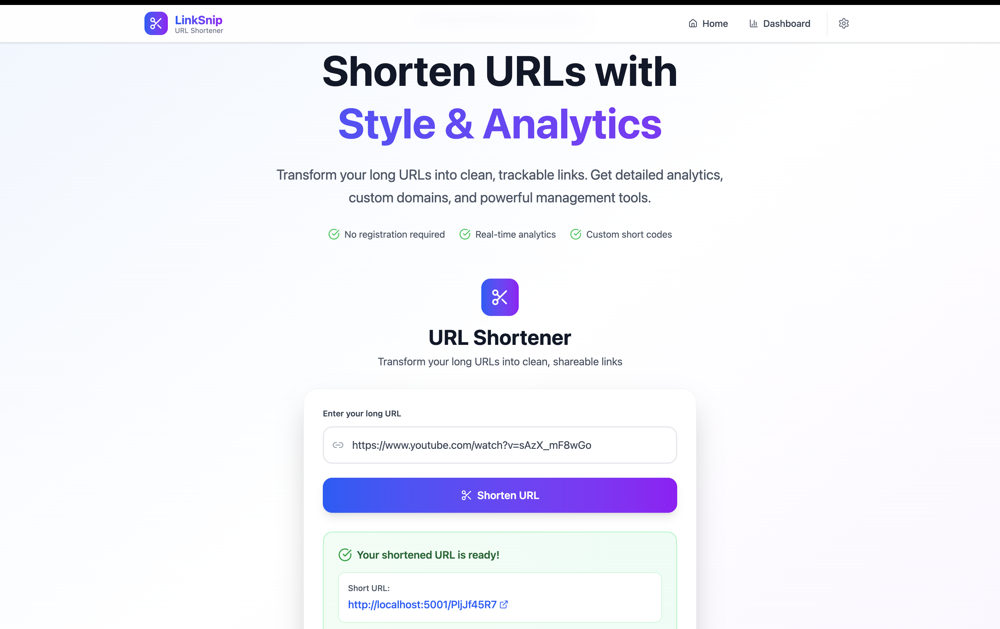
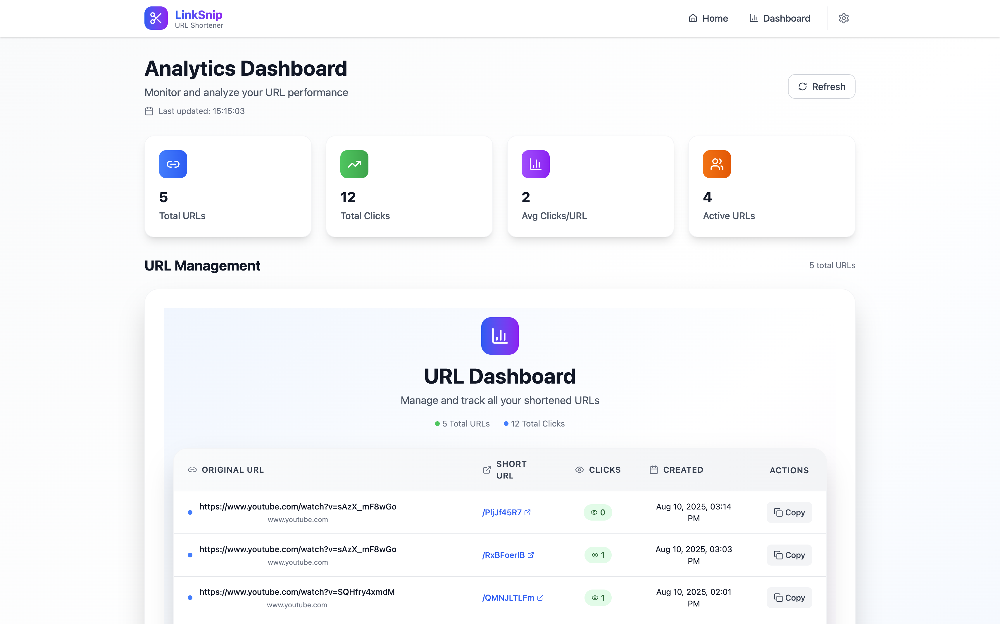

# 🔗 URL Shortener

A full-stack URL shortening service where users can paste a long URL, get a short shareable link, and track the number of times it has been clicked.

---

## 🚀 Live Demo

- **Frontend + Backend** (Render): ([https://url-shortener-9tmh.onrender.com](https://url-shortener-9tmh.onrender.com)
- 
  ⚠️ Please wait 2–3 minutes for the Render server to wake up.

---

## 📦 Tech Stack

- **Frontend**: React (Vite) + TailwindCSS + Zustand (State Management)
- **Backend**: Node.js + Express
- **Database**: MongoDB (via Mongoose)
- **Hosting**: Render (Frontend + Backend)

---

## 🛠️ Installation & Running Locally

### 1. Clone the repository

```bash
git clone https://github.com/your-username/url-shortener.git
cd url-shortener
````

### 2. Install Backend

```bash
npm install
npm run dev
```

Backend will run on `http://localhost:5001`

Create a `.env` file in `backend/` and add:

```
PORT=5001
MONGO_URI=your_mongodb_connection_string
```

---

### 3. Install Frontend

Open a new terminal:

```bash
cd frontend
npm install
npm run dev
```

Frontend will be available at `http://localhost:5173`

---

## ✨ Features

* 🔗 Shorten any valid URL
* 📋 Copy generated short link to clipboard
* 📊 Track click counts for each short URL
* 📅 View history of all shortened URLs with timestamps
* 🌐 Works across browsers (copy/share support)

---

## 📸 Screenshots

| Shortener Page                             | Stats Page                             |
| ------------------------------------------ | -------------------------------------- |
|  |  |

---

## 📐 Folder Structure

```
url-shortener/
│
├── backend/
│   ├── controllers/
│   │   └── url.controller.js
│   ├── models/
│   │   └── url.model.js
│   ├── routes/
│   │   └── url.routes.js
│   ├── server.js
│   └── .env
│
├── frontend/
│   ├── src/
│   │   ├── components/
│   │   │   ├── UrlShortenerForm.jsx
│   │   │   └── UrlList.jsx
│   │   ├── store/
│   │   │   └── useUrlStore.js
│   │   ├── pages/
│   │   │   ├── Home.jsx
│   │   │   └── Stats.jsx
│   │   ├── App.jsx
│   │   └── main.jsx
│   └── index.html
│
├── .gitignore
├── README.md
└── package.json
```

---

## 📬 API Endpoints

### 1. **POST** `/shorten`

Create a new shortened URL.
**Request Body**:

```json
{
  "originalUrl": "https://example.com"
}
```

**Response**:

```json
{
  "shortUrl": "http://localhost:5001/abc123"
}
```

---

### 2. **GET** `/urls`

Fetch all shortened URLs with click stats.

---

### 3. **GET** `/:shortcode`

Redirects to the original URL and increments click count.

---

## 📬 Feedback & Contributions

Feel free to open issues or submit pull requests. Feedback, suggestions, and improvements are welcome!

---

## 🔗 Useful Links

* [MongoDB](https://www.mongodb.com/)
* [Render](https://render.com/)
